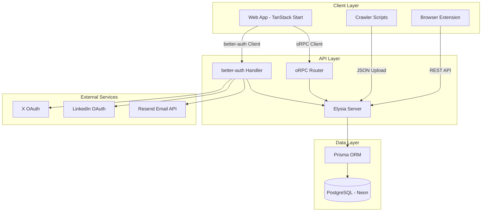

# Design Document

## Overview

The Social Bookmarks Manager (SBM) is a full-stack application built with a modern TypeScript stack that enables users to save, organize, and search bookmarks from X (Twitter) and LinkedIn. The system consists of:

- **Frontend**: TanStack Start (React-based) with reui.io components
- **Backend**: Elysia server with oRPC for type-safe API communication
- **Database**: PostgreSQL with Prisma ORM
- **Authentication**: better-auth with OAuth (X, LinkedIn) and magic link support
- **Browser Extension**: Chrome/Edge extension for bookmark capture
- **Crawler Scripts**: Browser-executable scripts for bulk bookmark extraction

The architecture follows a monorepo structure using Turborepo with separate packages for API, auth, and database concerns.

## Architecture

### High-Level Architecture



### Monorepo Structure

```
fav-book/
├── apps/
│   ├── web/                    # TanStack Start frontend
│   ├── server/                 # Elysia backend server
│   ├── extension/              # Browser extension (NEW)
│   └── fumadocs/              # Documentation
├── packages/
│   ├── api/                    # oRPC routers and procedures
│   ├── auth/                   # better-auth configuration
│   ├── db/                     # Prisma schema and client
│   └── shared/                 # Shared types and utilities (NEW)
└── scripts/
    ├── x-crawler.js           # X bookmark crawler (NEW)
    └── linkedin-crawler.js    # LinkedIn bookmark crawler (NEW)
```

## Components and Interfaces

### 1. Authentication System

**Technology**: better-auth library with Prisma adapter

**Components**:

- **OAuth Providers**: X (Twitter) and LinkedIn social login
- **Magic Link Provider**: Passwordless email authentication via Resend
- **Session Management**: Cookie-based sessions with secure attributes

**Server Configuration** (`packages/auth/src/index.ts`):

```typescript
import { betterAuth } from "better-auth";
import { prismaAdapter } from "better-auth/adapters/prisma";
import prisma from "@my-better-t-app/db";

export const auth = betterAuth({
  database: prismaAdapter(prisma, {
    provider: "postgresql",
  }),
  trustedOrigins: [process.env.WEB_URL],

  // Social OAuth providers
  socialProviders: {
    twitter: {
      clientId: process.env.TWITTER_CLIENT_ID,
      clientSecret: process.env.TWITTER_CLIENT_SECRET,
    },
    linkedin: {
      clientId: process.env.LINKEDIN_CLIENT_ID,
      clientSecret: process.env.LINKEDIN_CLIENT_SECRET,
    },
  },

  // Magic link configuration
  emailAndPassword: {
    enabled: false, // Disable password auth
  },
  magicLink: {
    enabled: true,
    sendMagicLink: async ({ email, url }) => {
      // Use Resend API with React Email templates
      await sendEmail({
        to: email,
        subject: "Sign in to Social Bookmarks Manager",
        react: MagicLinkEmail({ url }),
      });
    },
  },

  advanced: {
    defaultCookieAttributes: {
      sameSite: "none",
      secure: true,
      httpOnly: true,
    },
  },
});
```

**Elysia Server Integration** (`apps/server/src/index.ts`):

Reference: https://www.better-auth.com/docs/integrations/elysia

Better-auth provides direct Elysia integration that automatically handles all auth routes:

```typescript
import { Elysia } from "elysia";
import { cors } from "@elysiajs/cors";
import { auth } from "@my-better-t-app/auth";

const app = new Elysia()
  .use(
    cors({
      origin: process.env.WEB_URL,
      credentials: true,
    })
  )
  // Better-auth automatically mounts auth routes at /api/auth/*
  .all("/api/auth/*", ({ request }) => auth.handler(request))
  .use(
    orpcHandler({
      router: appRouter,
      prefix: "/api/orpc",
    })
  )
  .listen(3000);
```

The Elysia integration handles:

- All OAuth flows (X, LinkedIn)
- Magic link generation and verification
- Session management
- Cookie handling

**TanStack Start Direct Integration** (`apps/web/src/lib/auth.ts`):

Reference: https://www.better-auth.com/docs/integrations/tanstack

Better-auth provides direct TanStack Start integration with server-side session handling:

```typescript
import { betterAuth } from "better-auth/client";
import { createServerFn } from "@tanstack/start";

// Client-side auth instance
export const authClient = betterAuth({
  baseURL: import.meta.env.VITE_SERVER_URL,
});

// Server function to get session (runs on server)
export const getSession = createServerFn("GET", async (_, { request }) => {
  const session = await authClient.api.getSession({
    headers: request.headers,
  });
  return session;
});

// Export client methods
export const { signIn, signOut, signUp, useSession } = authClient;
```

**TanStack Start Route Protection** (`apps/web/src/routes/_authenticated.tsx`):

```typescript
import { createFileRoute, redirect } from "@tanstack/react-router";
import { getSession } from "../lib/auth";

// Layout route for all authenticated pages
export const Route = createFileRoute("/_authenticated")({
  beforeLoad: async ({ context, location }) => {
    const session = await getSession();

    if (!session?.user) {
      throw redirect({
        to: "/login",
        search: {
          redirect: location.href,
        },
      });
    }

    return {
      session,
    };
  },
});
```

**TanStack Start Auth Components** (`apps/web/src/components/auth/LoginForm.tsx`):

```typescript
import { authClient } from "@/lib/auth";

export function LoginForm() {
  const handleSocialLogin = async (provider: "twitter" | "linkedin") => {
    await authClient.signIn.social({
      provider,
      callbackURL: "/dashboard",
    });
  };

  const handleMagicLink = async (email: string) => {
    await authClient.signIn.magicLink({
      email,
      callbackURL: "/dashboard",
    });
  };

  return (
    // UI implementation with reui.io components
  );
}
```

**Email Templates** (`packages/shared/emails/`):

- Use React Email for templating
- MagicLinkEmail component with branded design
- Integration with Resend SDK

### 2. Database Schema

**Technology**: Prisma ORM with PostgreSQL (Neon)

**Schema Design** (`packages/db/prisma/schema/schema.prisma`):

```prisma
// User model (extended from better-auth)
model User {
  id            String         @id @default(cuid())
  email         String?        @unique
  emailVerified Boolean        @default(false)
  name          String?
  image         String?
  createdAt     DateTime       @default(now())
  updatedAt     DateTime       @updatedAt

  // Relations
  accounts      Account[]
  sessions      Session[]
  bookmarks     Bookmark[]
  collections   Collection[]

  @@map("users")
}

// Social account connections (better-auth)
model Account {
  id                String   @id @default(cuid())
  userId            String
  accountId         String
  providerId        String
  accessToken       String?
  refreshToken      String?
  expiresAt         DateTime?
  createdAt         DateTime @default(now())
  updatedAt         DateTime @updatedAt

  user              User     @relation(fields: [userId], references: [id], onDelete: Cascade)

  @@unique([providerId, accountId])
  @@map("accounts")
}

// Session management (better-auth)
model Session {
  id        String   @id @default(cuid())
  userId    String
  expiresAt DateTime
  token     String   @unique
  ipAddress String?
  userAgent String?
  createdAt DateTime @default(now())
  updatedAt DateTime @updatedAt

  user      User     @relation(fields: [userId], references: [id], onDelete: Cascade)

  @@map("sessions")
}

// Core bookmark model
model Bookmark {
  id              String         @id @default(cuid())
  userId          String
  platform        Platform       // X or LinkedIn
  postId          String         // Original post ID from platform
  postUrl         String         // Original URL
  authorName      String
  authorUsername  String
  authorAvatar    String?
  content         String         @db.Text
  publishedAt     DateTime
  savedAt         DateTime       @default(now())
  viewCount       Int            @default(0)
  lastViewedAt    DateTime?

  // Engagement metrics
  likes           Int            @default(0)
  retweets        Int            @default(0)
  replies         Int            @default(0)

  // Search and categorization
  searchVector    Unsupported("tsvector")?
  tags            String[]
  customNotes     String?        @db.Text

  // Future AI fields
  aiSummary       String?        @db.Text
  aiTopics        String[]

  createdAt       DateTime       @default(now())
  updatedAt       DateTime       @updatedAt

  // Relations
  user            User           @relation(fields: [userId], references: [id], onDelete: Cascade)
  media           Media[]
  collections     BookmarkCollection[]

  @@unique([userId, platform, postId])
  @@index([userId, savedAt])
  @@index([userId, platform])
  @@index([searchVector])
  @@map("bookmarks")
}

// Media attachments (images, videos, links)
model Media {
  id          String      @id @default(cuid())
  bookmarkId  String
  type        MediaType   // IMAGE, VIDEO, LINK
  url         String
  thumbnailUrl String?
  altText     String?
  width       Int?
  height      Int?
  duration    Int?        // For videos (seconds)
  order       Int         @default(0)
  createdAt   DateTime    @default(now())

  bookmark    Bookmark    @relation(fields: [bookmarkId], references: [id], onDelete: Cascade)

  @@index([bookmarkId])
  @@map("media")
}

// Collections for organizing bookmarks
model Collection {
  id          String               @id @default(cuid())
  userId      String
  name        String
  description String?              @db.Text
  color       String?              // Hex color for UI
  icon        String?              // Icon name
  isPublic    Boolean              @default(false)
  createdAt   DateTime             @default(now())
  updatedAt   DateTime             @updatedAt

  user        User                 @relation(fields: [userId], references: [id], onDelete: Cascade)
  bookmarks   BookmarkCollection[]

  @@index([userId])
  @@map("collections")
}

// Many-to-many relationship
model BookmarkCollection {
  bookmarkId   String
  collectionId String
  addedAt      DateTime @default(now())

  bookmark     Bookmark   @relation(fields: [bookmarkId], references: [id], onDelete: Cascade)
  collection   Collection @relation(fields: [collectionId], references: [id], onDelete: Cascade)

  @@id([bookmarkId, collectionId])
  @@map("bookmark_collections")
}

// Enums
enum Platform {
  X
  LINKEDIN
}

enum MediaType {
  IMAGE
  VIDEO
  LINK
}
```

**Indexes and Performance**:

- Full-text search using PostgreSQL `tsvector` on bookmark content
- Composite indexes on `userId + savedAt` for timeline queries
- Indexes on foreign keys for efficient joins
- Partial indexes for frequently filtered queries

### 3. API Layer (oRPC)

**Technology**: oRPC with Elysia server

**Router Structure** (`packages/api/src/routers/`):

```typescript
// auth.router.ts
export const authRouter = {
  getSession: procedure
    .use(authMiddleware)
    .output(z.object({ user: UserSchema }))
    .query(async ({ context }) => {
      return { user: context.user };
    }),

  logout: procedure.use(authMiddleware).mutation(async ({ context }) => {
    await auth.api.signOut({ headers: context.headers });
    return { success: true };
  }),
};

// bookmarks.router.ts
export const bookmarksRouter = {
  list: procedure
    .use(authMiddleware)
    .input(
      z.object({
        platform: z.enum(["X", "LINKEDIN"]).optional(),
        collectionId: z.string().optional(),
        search: z.string().optional(),
        limit: z.number().default(50),
        cursor: z.string().optional(),
      })
    )
    .output(
      z.object({
        bookmarks: z.array(BookmarkSchema),
        nextCursor: z.string().optional(),
      })
    )
    .query(async ({ input, context }) => {
      // Implementation with Prisma queries
    }),

  create: procedure
    .use(authMiddleware)
    .input(CreateBookmarkSchema)
    .output(BookmarkSchema)
    .mutation(async ({ input, context }) => {
      // Create bookmark with media
    }),

  delete: procedure
    .use(authMiddleware)
    .input(z.object({ id: z.string() }))
    .mutation(async ({ input, context }) => {
      // Soft delete or hard delete
    }),

  bulkImport: procedure
    .use(authMiddleware)
    .input(
      z.object({
        bookmarks: z.array(ImportBookmarkSchema),
      })
    )
    .mutation(async ({ input, context }) => {
      // Batch insert with transaction
    }),

  search: procedure
    .use(authMiddleware)
    .input(SearchInputSchema)
    .output(SearchResultSchema)
    .query(async ({ input, context }) => {
      // Full-text search with ranking
    }),
};

// collections.router.ts
export const collectionsRouter = {
  list: procedure.use(authMiddleware).query(async ({ context }) => {
    // List user's collections
  }),

  create: procedure
    .use(authMiddleware)
    .input(CreateCollectionSchema)
    .mutation(async ({ input, context }) => {
      // Create collection
    }),

  addBookmark: procedure
    .use(authMiddleware)
    .input(
      z.object({
        collectionId: z.string(),
        bookmarkId: z.string(),
      })
    )
    .mutation(async ({ input, context }) => {
      // Add bookmark to collection
    }),
};

// dashboard.router.ts
export const dashboardRouter = {
  getStats: procedure
    .use(authMiddleware)
    .output(DashboardStatsSchema)
    .query(async ({ context }) => {
      // Aggregate statistics
    }),

  getRecentBookmarks: procedure
    .use(authMiddleware)
    .input(z.object({ limit: z.number().default(10) }))
    .query(async ({ context, input }) => {
      // Recent bookmarks
    }),

  getTopViewed: procedure
    .use(authMiddleware)
    .input(z.object({ limit: z.number().default(10) }))
    .query(async ({ context, input }) => {
      // Most viewed bookmarks
    }),

  getTopics: procedure.use(authMiddleware).query(async ({ context }) => {
    // Extract topics from tags/AI
  }),
};
```

**Server Setup** (`apps/server/src/index.ts`):

```typescript
import { Elysia } from "elysia";
import { cors } from "@elysiajs/cors";
import { auth } from "@my-better-t-app/auth";
import { orpcHandler } from "@orpc/server/elysia";
import { appRouter } from "@my-better-t-app/api";

const app = new Elysia()
  .use(
    cors({
      origin: process.env.WEB_URL,
      credentials: true,
    })
  )
  .get("/api/auth/*", ({ request }) => auth.handler(request))
  .post("/api/auth/*", ({ request }) => auth.handler(request))
  .use(
    orpcHandler({
      router: appRouter,
      prefix: "/api/orpc",
    })
  )
  .listen(3000);
```

### 4. Frontend Application

**Technology**: TanStack Start with reui.io components

**Page Structure** (`apps/web/src/routes/`):

```
routes/
├── __root.tsx                 # Root layout with auth provider
├── index.tsx                  # Home/landing page
├── login.tsx                  # Login page (OAuth + magic link)
├── signup.tsx                 # Signup page
├── _authenticated/            # Protected routes
│   ├── dashboard/
│   │   └── index.tsx         # Dashboard with stats
│   ├── bookmarks/
│   │   ├── index.tsx         # Bookmark listing (cards/table)
│   │   └── $id.tsx           # Bookmark detail view
│   ├── collections/
│   │   ├── index.tsx         # Collections management
│   │   └── $id.tsx           # Collection detail
│   └── settings/
│       └── index.tsx         # User settings
```

**Key Components**:

1. **Authentication Forms** (`src/components/auth/`):

   - `LoginForm.tsx`: OAuth buttons + magic link input
   - `MagicLinkSent.tsx`: Confirmation message
   - Uses better-auth React client

2. **Dashboard Components** (`src/components/dashboard/`):

   - `StatsCards.tsx`: Platform counts, total bookmarks
   - `RecentBookmarks.tsx`: Latest saved items
   - `TopViewed.tsx`: Most accessed bookmarks
   - `TopicsCloud.tsx`: Tag/topic visualization

3. **Bookmark Components** (`src/components/bookmarks/`):

   - `BookmarkCard.tsx`: Card view with media preview
   - `BookmarkTable.tsx`: Table view with sorting
   - `BookmarkFilters.tsx`: reui.io filter components
   - `BookmarkDetail.tsx`: Full post view with actions

4. **Collection Components** (`src/components/collections/`):
   - `CollectionGrid.tsx`: Collection cards
   - `CollectionForm.tsx`: Create/edit collection
   - `AddToCollection.tsx`: Multi-select dialog

**State Management**:

- TanStack Query for server state
- oRPC TanStack Query integration for type-safe queries
- React Context for auth state
- URL state for filters and pagination

**Filtering Implementation** (using reui.io):

```typescript
import { Filters } from "@reui/filters";

const bookmarkFilters = [
  {
    id: "platform",
    label: "Platform",
    type: "select",
    options: [
      { value: "X", label: "X (Twitter)" },
      { value: "LINKEDIN", label: "LinkedIn" },
    ],
  },
  {
    id: "dateRange",
    label: "Date Range",
    type: "date-range",
  },
  {
    id: "mediaType",
    label: "Media Type",
    type: "checkbox",
    options: [
      { value: "IMAGE", label: "Images" },
      { value: "VIDEO", label: "Videos" },
      { value: "LINK", label: "Links" },
    ],
  },
  {
    id: "collection",
    label: "Collection",
    type: "select",
    options: collections.map((c) => ({ value: c.id, label: c.name })),
  },
];
```

### 5. Browser Extension

**Technology**: Chrome Extension Manifest V3

**Structure** (`apps/extension/`):

```
extension/
├── manifest.json
├── src/
│   ├── background/
│   │   └── service-worker.ts    # Background script
│   ├── content/
│   │   ├── x-content.ts         # X-specific content script
│   │   └── linkedin-content.ts  # LinkedIn-specific content script
│   ├── popup/
│   │   ├── popup.html
│   │   ├── popup.tsx            # React popup UI
│   │   └── popup.css
│   └── shared/
│       ├── api-client.ts        # API communication
│       └── types.ts
└── public/
    └── icons/
```

**Manifest Configuration**:

```json
{
  "manifest_version": 3,
  "name": "Social Bookmarks Manager",
  "version": "1.0.0",
  "permissions": ["storage", "activeTab", "cookies"],
  "host_permissions": [
    "https://twitter.com/*",
    "https://x.com/*",
    "https://linkedin.com/*",
    "https://www.linkedin.com/*"
  ],
  "background": {
    "service_worker": "background/service-worker.js"
  },
  "content_scripts": [
    {
      "matches": ["https://twitter.com/*", "https://x.com/*"],
      "js": ["content/x-content.js"]
    },
    {
      "matches": ["https://linkedin.com/*", "https://www.linkedin.com/*"],
      "js": ["content/linkedin-content.js"]
    }
  ],
  "action": {
    "default_popup": "popup/popup.html",
    "default_icon": {
      "16": "icons/icon16.png",
      "48": "icons/icon48.png",
      "128": "icons/icon128.png"
    }
  }
}
```

**Content Script Functionality**:

- Inject "Save" button on posts
- Extract post metadata (text, author, media URLs, engagement)
- Send data to background script
- Show save confirmation

**Background Script**:

- Handle API authentication
- Send bookmark data to server
- Manage extension state
- Handle cross-origin requests

### 6. Crawler Scripts

**Technology**: Vanilla JavaScript (browser console executable)

**X Crawler** (`scripts/x-crawler.js`):

```javascript
// Self-contained script that:
// 1. Scrolls through bookmarks page
// 2. Extracts post data from DOM
// 3. Handles pagination
// 4. Generates JSON output
// 5. Downloads file

(async function () {
  const bookmarks = [];
  let scrollCount = 0;
  const maxScrolls = 100;

  // Scroll and extract logic
  while (scrollCount < maxScrolls) {
    // Extract visible posts
    const posts = document.querySelectorAll('[data-testid="tweet"]');

    for (const post of posts) {
      // Extract metadata
      const data = {
        postId: extractPostId(post),
        content: extractContent(post),
        author: extractAuthor(post),
        media: extractMedia(post),
        engagement: extractEngagement(post),
        timestamp: extractTimestamp(post),
      };

      bookmarks.push(data);
    }

    // Scroll to load more
    window.scrollTo(0, document.body.scrollHeight);
    await sleep(2000);
    scrollCount++;
  }

  // Download JSON
  downloadJSON(bookmarks, "x-bookmarks.json");
})();
```

**LinkedIn Crawler** (`scripts/linkedin-crawler.js`):

- Similar structure adapted for LinkedIn DOM
- Handles LinkedIn's specific post structure
- Extracts professional content metadata

## Data Models

### TypeScript Schemas (`packages/shared/src/schemas/`)

```typescript
// User schema
export const UserSchema = z.object({
  id: z.string(),
  email: z.string().email().nullable(),
  name: z.string().nullable(),
  image: z.string().url().nullable(),
  createdAt: z.date(),
});

// Bookmark schema
export const BookmarkSchema = z.object({
  id: z.string(),
  userId: z.string(),
  platform: z.enum(["X", "LINKEDIN"]),
  postId: z.string(),
  postUrl: z.string().url(),
  authorName: z.string(),
  authorUsername: z.string(),
  authorAvatar: z.string().url().nullable(),
  content: z.string(),
  publishedAt: z.date(),
  savedAt: z.date(),
  viewCount: z.number(),
  lastViewedAt: z.date().nullable(),
  likes: z.number(),
  retweets: z.number(),
  replies: z.number(),
  tags: z.array(z.string()),
  customNotes: z.string().nullable(),
  media: z.array(MediaSchema),
  collections: z.array(CollectionSchema).optional(),
});

// Media schema
export const MediaSchema = z.object({
  id: z.string(),
  type: z.enum(["IMAGE", "VIDEO", "LINK"]),
  url: z.string().url(),
  thumbnailUrl: z.string().url().nullable(),
  altText: z.string().nullable(),
  width: z.number().nullable(),
  height: z.number().nullable(),
  duration: z.number().nullable(),
  order: z.number(),
});

// Collection schema
export const CollectionSchema = z.object({
  id: z.string(),
  userId: z.string(),
  name: z.string(),
  description: z.string().nullable(),
  color: z.string().nullable(),
  icon: z.string().nullable(),
  isPublic: z.boolean(),
  bookmarkCount: z.number().optional(),
  createdAt: z.date(),
  updatedAt: z.date(),
});

// Search input schema
export const SearchInputSchema = z.object({
  query: z.string().min(1),
  platform: z.enum(["X", "LINKEDIN"]).optional(),
  dateFrom: z.date().optional(),
  dateTo: z.date().optional(),
  mediaTypes: z.array(z.enum(["IMAGE", "VIDEO", "LINK"])).optional(),
  collectionId: z.string().optional(),
  tags: z.array(z.string()).optional(),
  sortBy: z.enum(["relevance", "date", "views"]).default("relevance"),
  limit: z.number().default(50),
  offset: z.number().default(0),
});

// Dashboard stats schema
export const DashboardStatsSchema = z.object({
  totalBookmarks: z.number(),
  bookmarksByPlatform: z.object({
    X: z.number(),
    LINKEDIN: z.number(),
  }),
  recentCount: z.number(),
  collectionsCount: z.number(),
  topTopics: z.array(
    z.object({
      topic: z.string(),
      count: z.number(),
    })
  ),
});
```

## Error Handling

### API Error Responses

```typescript
// Standardized error format
export class AppError extends Error {
  constructor(
    public code: string,
    public message: string,
    public statusCode: number,
    public details?: unknown
  ) {
    super(message);
  }
}

// Error codes
export const ErrorCodes = {
  UNAUTHORIZED: "UNAUTHORIZED",
  FORBIDDEN: "FORBIDDEN",
  NOT_FOUND: "NOT_FOUND",
  VALIDATION_ERROR: "VALIDATION_ERROR",
  DUPLICATE_BOOKMARK: "DUPLICATE_BOOKMARK",
  RATE_LIMIT_EXCEEDED: "RATE_LIMIT_EXCEEDED",
  EXTERNAL_API_ERROR: "EXTERNAL_API_ERROR",
} as const;

// Error middleware
export const errorHandler = (error: unknown) => {
  if (error instanceof AppError) {
    return {
      error: {
        code: error.code,
        message: error.message,
        details: error.details,
      },
      status: error.statusCode,
    };
  }

  // Log unexpected errors
  console.error("Unexpected error:", error);

  return {
    error: {
      code: "INTERNAL_ERROR",
      message: "An unexpected error occurred",
    },
    status: 500,
  };
};
```

### Frontend Error Handling

```typescript
// React Error Boundary for component errors
export class ErrorBoundary extends React.Component {
  // Standard error boundary implementation
}

// Query error handling with TanStack Query
export const useBookmarks = () => {
  return useQuery({
    queryKey: ["bookmarks"],
    queryFn: () => orpcClient.bookmarks.list.query({}),
    onError: (error) => {
      toast.error("Failed to load bookmarks");
      console.error(error);
    },
    retry: 3,
    retryDelay: (attemptIndex) => Math.min(1000 * 2 ** attemptIndex, 30000),
  });
};
```

### Extension Error Handling

- Graceful degradation when API is unavailable
- Local storage fallback for offline saves
- User-friendly error messages in popup
- Retry logic for failed requests

## Testing Strategy

### Unit Tests

**Backend** (`packages/api/src/**/*.test.ts`):

- Test oRPC procedures in isolation
- Mock Prisma client
- Test validation schemas
- Test business logic functions

**Frontend** (`apps/web/src/**/*.test.tsx`):

- Component unit tests with React Testing Library
- Test user interactions
- Test form validation
- Mock API calls

### Integration Tests

**API Integration** (`apps/server/src/**/*.integration.test.ts`):

- Test full request/response cycle
- Use test database
- Test authentication flows
- Test data persistence

**E2E Tests** (`apps/web/e2e/**/*.spec.ts`):

- Use Playwright for browser automation
- Test critical user flows:
  - Login with magic link
  - Save bookmark via extension
  - Search and filter bookmarks
  - Create and manage collections
  - Bulk import from crawler

### Extension Testing

- Manual testing in Chrome/Edge
- Test content script injection
- Test API communication
- Test different post formats

### Performance Testing

- Load testing with k6 or Artillery
- Database query performance monitoring
- Frontend bundle size optimization
- Lighthouse scores for web vitals

## Security Considerations

### Authentication Security

- Secure cookie attributes (httpOnly, secure, sameSite)
- CSRF protection via better-auth
- OAuth state parameter validation
- Magic link expiration (15 minutes)
- Rate limiting on auth endpoints

### API Security

- Authentication middleware on all protected routes
- Input validation with Zod schemas
- SQL injection prevention via Prisma
- Rate limiting per user/IP
- CORS configuration

### Data Privacy

- User data isolation (row-level security)
- Encrypted database connections
- No storage of OAuth tokens beyond refresh
- GDPR compliance considerations
- Data export functionality

### Extension Security

- Content Security Policy
- Minimal permissions
- Secure message passing
- No eval() or inline scripts
- Regular security audits

## Performance Optimization

### Database Optimization

- Proper indexing strategy
- Connection pooling with Prisma
- Query optimization with `select` and `include`
- Pagination for large datasets
- Full-text search indexes

### Frontend Optimization

- Code splitting with TanStack Start
- Image optimization and lazy loading
- Virtual scrolling for large lists
- Debounced search inputs
- Optimistic updates with TanStack Query

### Caching Strategy

- TanStack Query cache configuration
- Stale-while-revalidate pattern
- CDN caching for static assets
- Redis caching for expensive queries (future)

### API Optimization

- Batch operations for bulk imports
- Streaming responses for large datasets
- Compression middleware
- Database query batching

## Deployment Architecture

### Web Application (Alchemy)

- Deploy to Cloudflare Workers
- Environment variables configuration
- Custom domain setup
- SSL/TLS certificates

### Backend Server

- Self-hosted or cloud deployment
- Environment variables management
- Health check endpoints
- Logging and monitoring

### Database (Neon)

- PostgreSQL serverless
- Automatic backups
- Connection pooling
- Read replicas (future scaling)

### Browser Extension

- Chrome Web Store submission
- Version management
- Update mechanism
- User feedback collection

## Future Enhancements

### AI Integration

- Automatic summarization of bookmarks
- Topic extraction and categorization
- Semantic search with embeddings
- Recommendation engine
- Duplicate detection

### Additional Features

- Public collections sharing
- Collaborative collections
- Export to various formats (PDF, Markdown)
- Browser extension for Firefox/Safari
- Mobile app (React Native)
- Webhook integrations
- API for third-party apps

### Scalability

- Microservices architecture
- Message queue for async processing
- Elasticsearch for advanced search
- CDN for media storage
- Multi-region deployment
